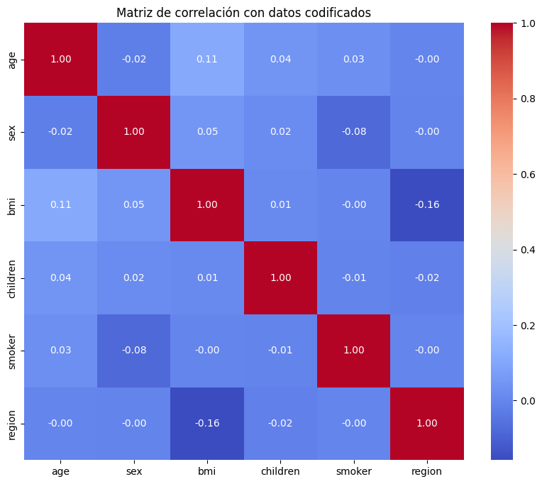
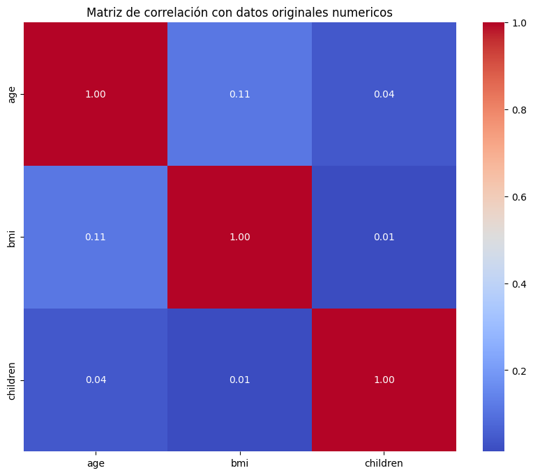
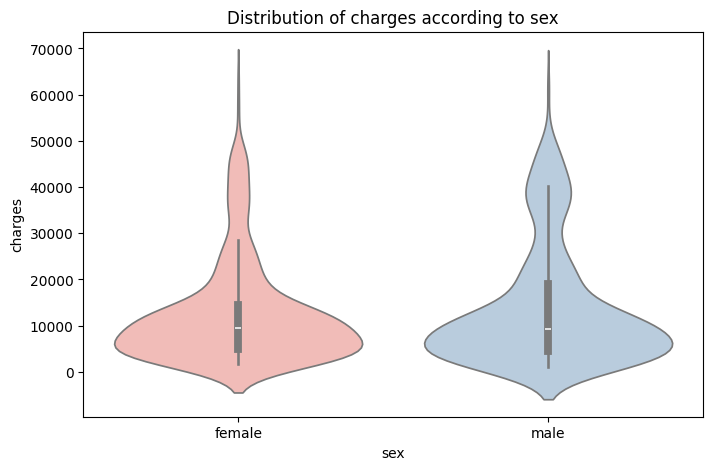
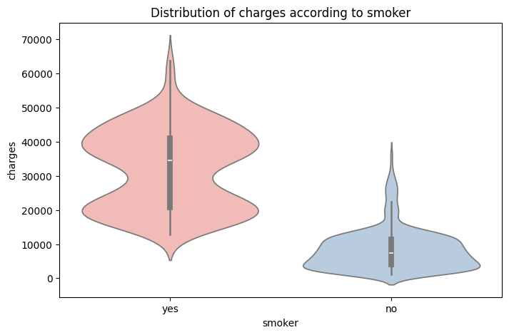
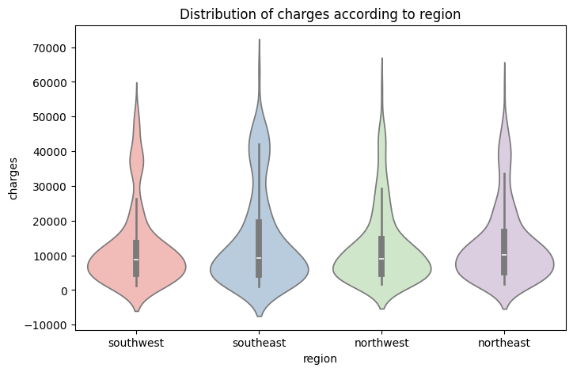
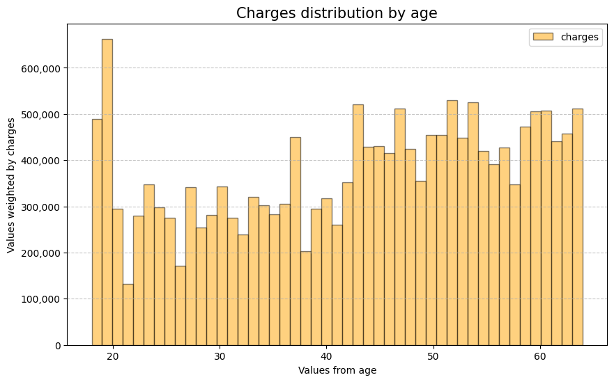
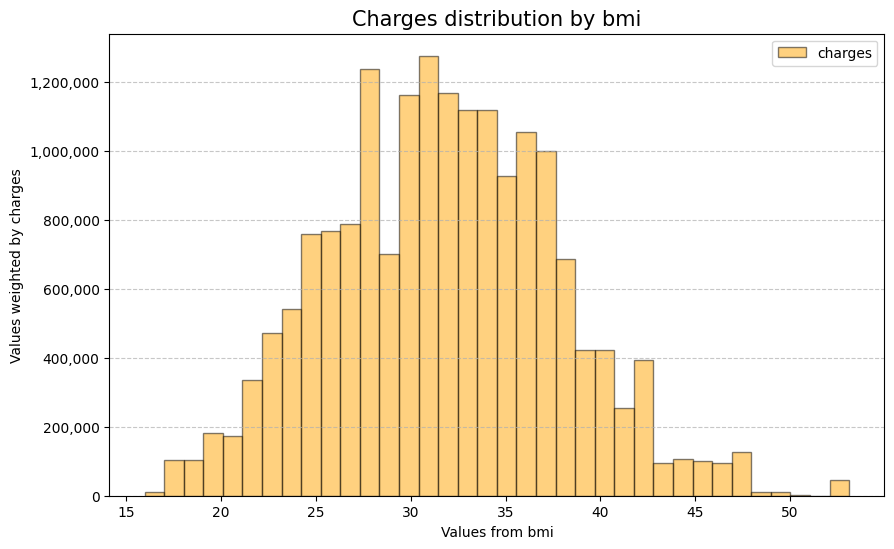
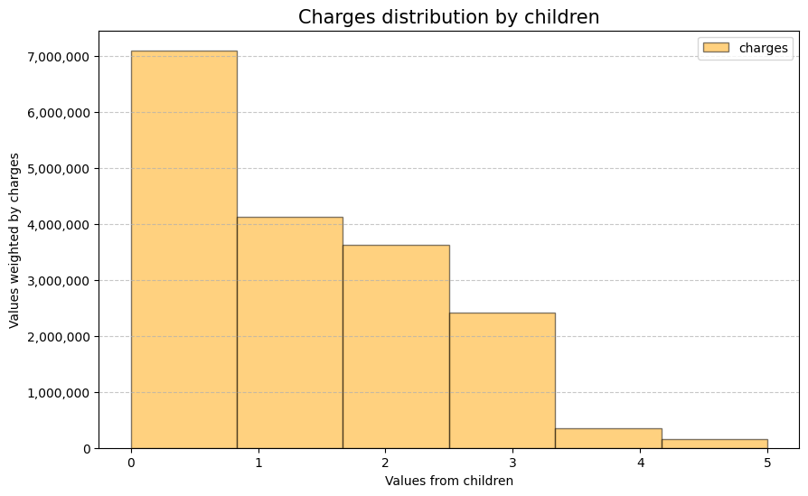
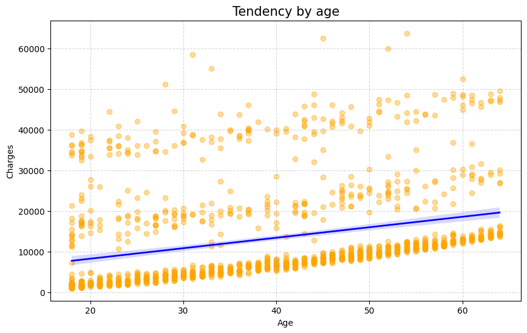
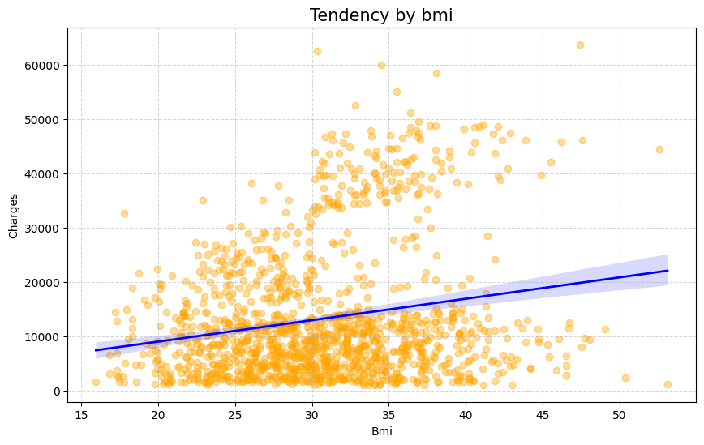

# 📈 Análisis Exploratorio de Datos (EDA)

---

## 🌎 Language / Idioma
- [English Version](#english)
- [Versión en Español](#español)

---

## 🇪🇸 Versión en Español

Este documento detalla el proceso de exploración de datos para el proyecto de **Predicción de Costos de Seguros Médicos**.

---

## 🛠️ Stack Técnico
Este análisis fue realizado utilizando el lenguaje **Python** y las siguientes librerías:

*   **Pandas**: Manipulación y análisis de datos.
*   **NumPy**: Cálculos numéricos avanzados.
*   **Matplotlib** & **Seaborn**: Visualizaciones dinámicas y estadísticas.
*   **Scikit-Learn**: Preprocesamiento de datos.

---

## 📋 Resumen del Dataset

El conjunto de datos contiene **1338 registros** sin valores nulos, con las siguientes características:

*   **age**: Edad del beneficiario principal.
*   **sex**: Género del contratista (female, male).
*   **bmi**: Índice de masa corporal (kg / m²).
*   **children**: Número de hijos/dependientes cubiertos.
*   **smoker**: Estado de fumador (yes, no).
*   **region**: Área residencial en EE. UU.
*   **charges**: Costos médicos individuales (Variable objetivo 🎯).

### 📊 Distribución de Características

| Característica | Detalle |
| :--- | :--- |
| **Edad** | Máx: 64 | Media: 39 | Mín: 18 |
| **Género** | Mujer: 49.48% | Hombre: 50.52% |
| **BMI** | Máx: 53.13 | Media: 30.66 | Mín: 15.96 |
| **Hijos** | 0: 42.9% \| 1: 24.2% \| 2: 17.9% \| 3: 11.7% \| 4+: 3.2% |
| **Fumador** | Sí: 20.48% | No: 79.52% |
| **Regiones** | Distribución equitativa (~24-27% por región) |

---

## 🔍 Hallazgos Clave

> [!IMPORTANT]
> ### 1. Variable Objetivo (Charges)
> La distribución de `charges` tiene un sesgo a la derecha. La mayoría paga menos de $15,000, pero hay un grupo con costos significativamente altos.

> [!TIP]
> ### 2. Correlaciones Principales
> *   **Edad**: Existe una clara correlación positiva con los costos.
> *   **Fumador**: Es el factor más determinante. Los fumadores tienen costos drásticamente superiores.
> *   **BMI**: Influye notablemente, especialmente en fumadores.

> [!NOTE]
> ### 3. Análisis por Categoría
> *   **Género**: Los costos son similares, aunque los hombres presentan valores extremos ligeramente más altos.
> *   **Región**: El `southeast` muestra costos promedio y BMI levemente superiores.

---

## 🖼️ Visualizaciones de Correlación

*Figura: Correlación entre variables codificadas.*

*Figura: Correlación entre variables numéricas.*

---

## 🎨 Insights Visuales
*(Visualizaciones generadas en el notebook `notebooks/data_exploration.ipynb`)*

### Distribución de Costos por Categoría

### Histogramas de Distribución

### Tendencias (Regresión)

---

## 🇬🇧 English Version

# 📈 Exploratory Data Analysis (EDA)

This document provides a detailed overview of the data exploration process for the **Medical Insurance Cost Prediction** project.

---

## 🛠️ Technical Stack
This analysis was performed using **Python** and the following libraries:

*   **Pandas**: Data manipulation and analysis.
*   **NumPy**: Advanced numerical computing.
*   **Matplotlib** & **Seaborn**: Dynamic and statistical visualizations.
*   **Scikit-Learn**: Data preprocessing.

---

## 📋 Dataset Overview

The dataset contains **1338 records** with no null values, featuring:

*   **age**: Age of the primary beneficiary.
*   **sex**: Insurance contractor gender (female, male).
*   **bmi**: Body mass index (kg / m²).
*   **children**: Number of children/dependents covered.
*   **smoker**: Smoking status (yes, no).
*   **region**: Residential area in the US.
*   **charges**: Individual medical costs (Target Variable 🎯).

### 📊 Feature Distribution

| Feature | Detail |
| :--- | :--- |
| **Age** | Max: 64 | Mean: 39 | Min: 18 |
| **Gender** | Female: 49.48% | Male: 50.52% |
| **BMI** | Max: 53.13 | Mean: 30.66 | Min: 15.96 |
| **Children** | 0: 42.9% \| 1: 24.2% \| 2: 17.9% \| 3: 11.7% \| 4+: 3.2% |
| **Smoker** | Yes: 20.48% | No: 79.52% |
| **Region** | Equitable distribution (~24-27% per region) |

---

## 🔍 Key Findings

> ### 1. Target Variable Distribution (Charges)
> The distribution of `charges` is right-skewed. Most individuals pay less than $15,000, but there is a group with significantly higher costs.

> ### 2. Main Correlations
> *   **Age**: There is a clear positive correlation with medical costs.
> *   **Smoker**: This is the most significant determinant. Smokers have drastically higher costs.
> *   **BMI**: Influences costs notably, especially when combined with smoking.

> ### 3. Categorical Analysis
> *   **Gender**: Costs are similar across genders, though males show slightly higher extreme values.
> *   **Region**: The `southeast` region tends to have slightly higher average costs and higher BMI values.

---

## 🖼️ Correlation Visualizations

*Figure: Correlation between coded features.*

*Figure: Correlation between numeric features.*

---

## 🎨 Visual Insights
*(Visualizations generated in the `notebooks/data_exploration.ipynb` notebook)*

### Cost Distribution by Category

### Distribution Histograms

### Trends (Regression)

