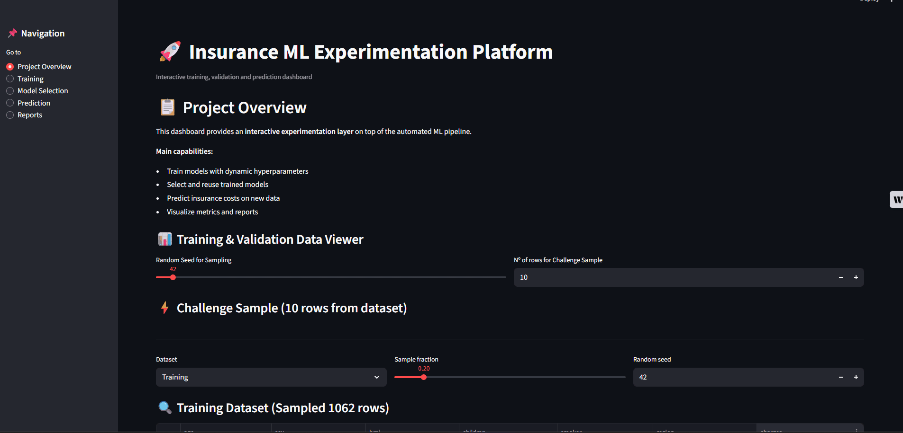
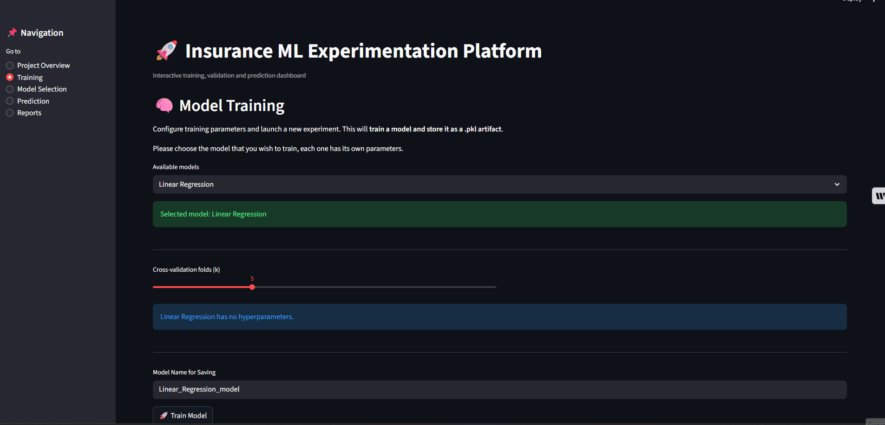
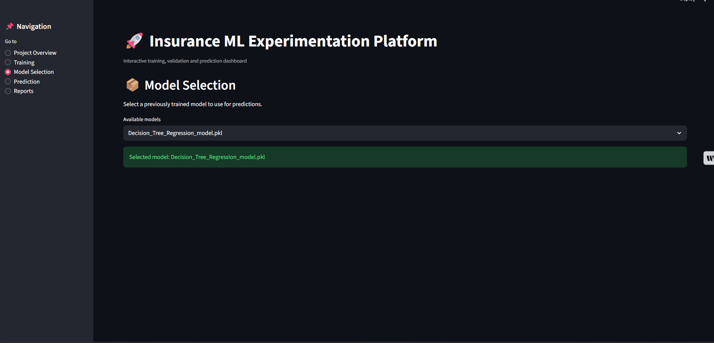

# 🚀 Dashboard de Streamlit

---

## 🌎 Language / Idioma
- [English Version](#english)
- [Versión en Español](#español)

---

<a name="español"></a>
## 🇪🇸 Versión en Español

Este documento detalla las funcionalidades y la estructura del dashboard interactivo desarrollado con **Streamlit** para este proyecto.

---

## 🛠️ Stack Técnico
El dashboard utiliza las siguientes tecnologías:

*   **Python**: Lógica del backend.
*   **Streamlit**: Framework para la interfaz interactiva.
*   **Pandas**: Visualización y gestión de datos.
*   **Subprocess**: Manejo de scripts externos para reportes.

---

## 🕹️ Funcionalidades por Página

El dashboard se divide en 5 secciones principales:

1.  **Project Overview**: Visualización de los conjuntos de entrenamiento, prueba y validación. Permite ajustar semillas aleatorias y tamaños de muestra.
2.  **Training**: Permite entrenar 4 tipos de modelos (Lineal, Polinómica, Boosting y Árboles) configurando sus hiperparámetros desde la UI.
3.  **Model Selection**: Carga y gestión de archivos `.pkl` previamente entrenados.
4.  **Prediction**: Entrada manual de datos para predecir costos de seguros en tiempo real, junto con una sección de validación masiva.
5.  **Reports**: Gestión de informes PDF y visualización de figuras generadas por el pipeline.

---

## ⚙️ Notas de Desarrollo

Para ejecutar el dashboard localmente:
```bash
streamlit run streamlit/streamlit_app.py
```

---

<a name="english"></a>
## 🇬🇧 English Version

This document details the features and structure of the interactive dashboard developed with **Streamlit** for this project.

---

## 🛠️ Technical Stack
The dashboard leverages the following technologies:

*   **Python**: Backend logic.
*   **Streamlit**: Interactive UI framework.
*   **Pandas**: Data visualization and management.
*   **Subprocess**: Handling external reporting scripts.

---

## 🕹️ Page-by-Page Features

The dashboard is divided into 5 main sections:

1.  **Project Overview**: Viewer for training, testing, and validation sets. Allows adjusting random seeds and sample sizes.




2.  **Training**: Train 4 different model types (Linear, Polynomial, Boosting, and Trees) by configuring hyperparameters via the UI.




3.  **Model Selection**: Selection and management of previously trained `.pkl` files.
4.  **Prediction**: Manual data input for real-time insurance cost prediction, plus a mass validation section.



5.  **Reports**: PDF report management and visualization of pipeline-generated figures.


---

## ⚙️ Development Notes

To run the dashboard locally:
```bash
streamlit run streamlit/streamlit_app.py
```
